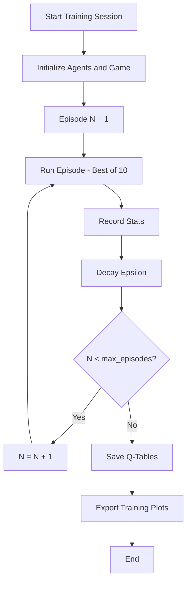
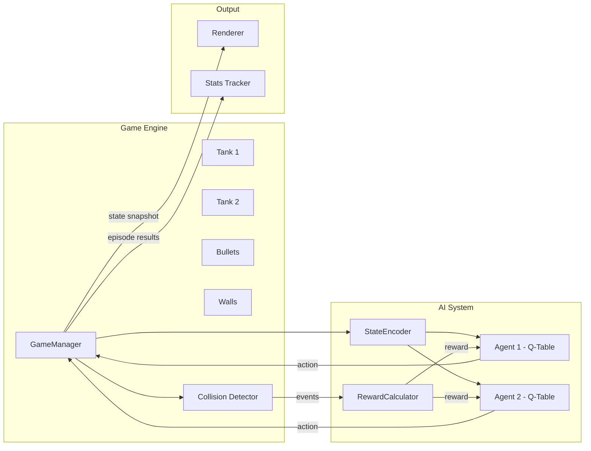

# Tank Duel AI -- Architecture Design Document

## 1. Overview

A top-down 2D tank dueling game built with Pygame where two AI-controlled tanks learn to fight each other through reinforcement learning (tabular Q-learning). The arena contains breakable walls that provide cover and degrade under fire. A match (episode) is a best-of-10 scoring system.

---

## 2. File Structure

```
dueling-ai/
|-- main.py                  # Entry point, CLI args, launches training or demo
|-- config.py                # All tunable constants (arena size, speeds, rewards, etc.)
|
|-- game/
|   |-- __init__.py
|   |-- arena.py             # Arena class -- world boundaries and wall generation
|   |-- tank.py              # Tank class -- movement, rotation, shooting
|   |-- bullet.py            # Bullet class -- travel, lifetime
|   |-- wall.py              # Wall class -- HP, degradation states
|   |-- collision.py         # All collision detection functions
|   |-- game_manager.py      # GameManager -- scoring, episode lifecycle, step loop
|
|-- ai/
|   |-- __init__.py
|   |-- state_encoder.py     # Discretizes raw game state into a hashable tuple
|   |-- agent.py             # QLearningAgent -- Q-table, epsilon-greedy, learn()
|   |-- reward.py            # Reward calculator -- centralizes reward logic
|
|-- rendering/
|   |-- __init__.py
|   |-- renderer.py          # Pygame drawing -- tanks, bullets, walls, HUD
|   |-- colors.py            # Color palette constants
|
|-- training/
|   |-- __init__.py
|   |-- trainer.py           # Training loop orchestrator, progress logging
|   |-- stats.py             # Win/loss tracking, rolling averages, plot export
|
|-- assets/                  # Optional sprite images (can fall back to primitives)
|-- saved_models/            # Serialized Q-tables (pickle or JSON)
|-- plans/
|   |-- ARCHITECTURE.md      # This file
```

---

## 3. Class Architecture

### 3.1 Class Diagram

```
+---------------------+       +---------------------+
|     GameManager     |<>---->|       Arena          |
|---------------------|       |---------------------|
| score: dict         |       | width: int          |
| max_points: int     |       | height: int         |
| current_episode: int|       | walls: list[Wall]   |
| tanks: list[Tank]   |       |---------------------|
| bullets: list[Bullet]       | generate_walls()    |
| arena: Arena        |       | get_wall_at(x,y)    |
|---------------------|       +---------------------+
| reset_round()       |              |
| step(actions)       |              | contains
| is_episode_over()   |              v
| get_winner()        |       +---------------------+
+---------------------+       |       Wall           |
        |                     |---------------------|
        | manages             | rect: Rect          |
        v                     | max_hp: int         |
+---------------------+       | hp: int             |
|       Tank          |       |---------------------|
|---------------------|       | take_damage(amount) |
| id: int             |       | is_destroyed() bool |
| x, y: float         |       | damage_ratio() float|
| rotation: float     |       +---------------------+
| speed: float        |
| rotation_speed: float|      +---------------------+
| shoot_cooldown: int  |      |      Bullet         |
| cooldown_timer: int  |      |---------------------|
| color: tuple         |      | x, y: float        |
|---------------------|       | dx, dy: float      |
| move_forward()      |       | speed: float       |
| move_backward()     |       | owner_id: int      |
| rotate_left()       |       | alive: bool        |
| rotate_right()      |       |---------------------|
| shoot() -> Bullet   |       | update()           |
| get_turret_tip()    |       | get_rect() -> Rect |
| get_rect() -> Rect  |       +---------------------+
| update_cooldown()   |
+---------------------+

+---------------------+       +---------------------+
|   QLearningAgent    |<----->|   StateEncoder      |
|---------------------|       |---------------------|
| q_table: dict       |       | angle_bins: int     |
| alpha: float        |       | dist_bins: int      |
| gamma: float        |       | wall_ray_count: int |
| epsilon: float      |       |---------------------|
| epsilon_decay: float|       | encode(game_state,  |
| epsilon_min: float  |       |   tank_id) -> tuple |
| action_space: list  |       | _bucket_angle()     |
|---------------------|       | _bucket_distance()  |
| choose_action(state)|       | _cast_wall_rays()   |
| learn(s,a,r,s_next) |       +---------------------+
| decay_epsilon()     |
| save(path)          |       +---------------------+
| load(path)          |       |   RewardCalculator  |
+---------------------+       |---------------------|
                              | hit_reward: float   |
+---------------------+       | got_hit_penalty: fl |
|     Renderer        |       | timestep_cost: float|
|---------------------|       | wall_break_bonus: fl|
| screen: Surface     |       |---------------------|
| font: Font          |       | calculate(events,   |
|---------------------|       |   tank_id) -> float |
| draw_frame(state)   |       +---------------------+
| draw_tank(tank)     |
| draw_bullet(bullet) |
| draw_wall(wall)     |
| draw_hud(scores)    |
| draw_training_info()|
+---------------------+
```

### 3.2 Class Responsibilities

| Class | Responsibility |
|-------|---------------|
| `GameManager` | Owns the game loop tick. Receives actions from both agents, advances physics, detects collisions, tracks score, determines round/episode end. |
| `Arena` | Holds arena dimensions and the collection of `Wall` objects. Responsible for procedural wall placement at the start of each round. |
| `Tank` | Stores position, rotation, cooldown state. Exposes movement and shooting primitives. Does NOT decide its own actions. |
| `Bullet` | Simple projectile. Updates position each tick. Knows its owner so friendly-fire rules or scoring can be applied. |
| `Wall` | Axis-aligned rectangle with HP. Tracks damage ratio for visual degradation. |
| `QLearningAgent` | Maintains a Q-table mapping `(state, action) -> value`. Implements epsilon-greedy selection and Q-learning update rule. |
| `StateEncoder` | Translates the continuous game world into a compact, discretized tuple suitable as a Q-table key. |
| `RewardCalculator` | Pure function that maps a list of frame events (hit, got_hit, wall_destroyed, etc.) to a scalar reward for a given tank. |
| `Renderer` | All Pygame draw calls. Accepts the current game state as input; has zero game logic. |

---

## 4. Game Mechanics

### 4.1 Arena Layout

- Fixed rectangular play area (default 800 x 600 pixels).
- Tanks spawn in opposite corners with some random offset.
- Walls are placed in a semi-random pattern each round. A generation algorithm places 8-14 wall blocks in the central region, ensuring both tanks have clear initial lines of sight to encourage early engagement.

### 4.2 Tank Movement

| Property | Value |
|----------|-------|
| Size | 32 x 24 px rectangle |
| Forward/backward speed | 2 px/tick |
| Rotation speed | 5 deg/tick |
| Shoot cooldown | 30 ticks (~0.5s at 60 FPS) |

- Tanks move along their facing direction vector `(cos(rotation), sin(rotation))`.
- Backward movement uses the negated vector at 60% speed.
- Tanks cannot overlap walls or leave the arena boundary. Attempted moves that cause collision are rejected (tank stays in place).

### 4.3 Bullet Physics

| Property | Value |
|----------|-------|
| Size | 4 px radius circle |
| Speed | 6 px/tick |
| Lifetime | 180 ticks (3 seconds) |

- Spawns at the turret tip of the firing tank, traveling in the tank's facing direction.
- Each tick: `x += dx * speed`, `y += dy * speed`.
- Destroyed when: hits a tank (not its owner), hits a wall, exits arena bounds, or lifetime expires.
- Maximum 3 bullets alive per tank at any time to prevent spray strategies.

### 4.4 Breakable Walls

| Property | Value |
|----------|-------|
| Size | 40 x 40 px block |
| Max HP | 3 |
| Damage per bullet | 1 |

Visual degradation stages:
```
HP 3: [#########]  Solid, full color
HP 2: [### # ###]  Cracks appear (lighter shade, gap pattern)
HP 1: [#   #   #]  Heavy damage (mostly transparent, sparse fill)
HP 0: (removed)    Destroyed, open space
```

Walls absorb the bullet that hits them (bullet is destroyed on impact).

### 4.5 Collision Detection

All collision checks use axis-aligned bounding box (AABB) intersection via Pygame's `Rect.colliderect()`:

1. **Bullet vs Tank**: Score point for bullet owner. Bullet destroyed. Round resets.
2. **Bullet vs Wall**: Wall takes 1 damage. Bullet destroyed.
3. **Bullet vs Boundary**: Bullet destroyed.
4. **Tank vs Wall**: Movement rejected (tank does not move this tick).
5. **Tank vs Boundary**: Movement clamped to arena edge.
6. **Tank vs Tank**: Both movements rejected for that tick.

Priority order each tick:
```
1. Process actions (movement + rotation for both tanks)
2. Validate tank positions (collision rollback if needed)
3. Update cooldown timers
4. Spawn new bullets (if shoot action and cooldown ready)
5. Move all bullets
6. Check bullet collisions (walls first, then tanks, then bounds)
7. Remove destroyed walls and dead bullets
8. Check scoring conditions
```

---

## 5. AI / Reinforcement Learning System

### 5.1 Approach: Tabular Q-Learning

Tabular Q-learning is chosen for feasibility and transparency. The state space is aggressively discretized to keep the Q-table tractable. Both tanks use independent Q-learning agents with identical architectures but separate Q-tables, allowing asymmetric strategy development.

### 5.2 State Space

The state is encoded as a tuple of discrete integers:

| Feature | Bins | Description |
|---------|------|-------------|
| Relative angle to enemy | 8 | Angle from this tank's facing direction to the enemy, bucketed into 45-degree sectors |
| Distance to enemy | 4 | Euclidean distance bucketed: close / medium / far / very-far |
| Enemy relative angle sector | 4 | Which quadrant is the enemy facing relative to us: toward / away / left / right |
| Wall proximity (front) | 3 | Raycast forward: clear / nearby / blocked |
| Wall proximity (left) | 3 | Raycast 90 deg left: clear / nearby / blocked |
| Wall proximity (right) | 3 | Raycast 90 deg right: clear / nearby / blocked |
| Cooldown ready | 2 | Boolean: can shoot this tick or not |
| Nearest bullet threat | 3 | Is an enemy bullet approaching: none / distant / imminent |

**Total state space size**: 8 x 4 x 4 x 3 x 3 x 3 x 2 x 3 = **20,736 states**

This is well within the range where tabular Q-learning converges reliably.

### 5.3 State Encoding Detail

```
encode(game_state, tank_id) -> tuple:

  me = game_state.tanks[tank_id]
  enemy = game_state.tanks[1 - tank_id]

  # 1. Relative angle to enemy (8 bins of 45 deg)
  angle_to_enemy = atan2(enemy.y - me.y, enemy.x - me.x)
  relative_angle = normalize(angle_to_enemy - me.rotation)
  bin_angle = floor(relative_angle / 45) % 8

  # 2. Distance to enemy (4 bins)
  dist = euclidean(me, enemy)
  bin_dist = clip(floor(dist / DIST_STEP), 0, 3)

  # 3. Enemy facing direction relative to me (4 quadrants)
  enemy_angle_to_me = atan2(me.y - enemy.y, me.x - enemy.x)
  enemy_relative = normalize(enemy_angle_to_me - enemy.rotation)
  bin_enemy_facing = floor(enemy_relative / 90) % 4

  # 4-6. Wall raycasts (3 bins each: 0=clear, 1=nearby, 2=blocked)
  for direction in [forward, left, right]:
    cast ray from tank center in direction
    measure distance to first wall hit
    bucket into 3 levels

  # 7. Cooldown ready (boolean)
  can_shoot = 1 if me.cooldown_timer == 0 else 0

  # 8. Bullet threat (3 levels)
  threat = assess_incoming_bullets(enemy_bullets, me)

  return (bin_angle, bin_dist, bin_enemy_facing,
          wall_front, wall_left, wall_right,
          can_shoot, threat)
```

### 5.4 Action Space

Six discrete actions:

| Index | Action | Effect |
|-------|--------|--------|
| 0 | FORWARD | Move along facing direction |
| 1 | BACKWARD | Move opposite to facing direction (slower) |
| 2 | ROTATE_LEFT | Rotate counter-clockwise |
| 3 | ROTATE_RIGHT | Rotate clockwise |
| 4 | SHOOT | Fire bullet (if cooldown ready, else no-op) |
| 5 | NOOP | Do nothing |

**Design note**: Only one action per tick. This keeps the action space small (6 actions) at the cost of not being able to move and shoot simultaneously. This is an intentional tradeoff for Q-table tractability. A future enhancement could use composite actions (move+shoot) expanding to ~12 actions.

### 5.5 Reward Structure

| Event | Reward | Rationale |
|-------|--------|-----------|
| Hit enemy with bullet | +10.0 | Primary objective |
| Got hit by enemy bullet | -10.0 | Primary penalty |
| Destroyed a wall | +0.5 | Encourages opening sight lines |
| Wasted shot (missed everything, expired) | -0.2 | Discourages blind firing |
| Each timestep | -0.01 | Encourages decisive action |
| Moved closer to enemy | +0.05 | Mild shaping reward for engagement |

Rewards are applied at the end of each tick. The `RewardCalculator` collects events from `GameManager` and sums them per agent.

### 5.6 Q-Learning Update

Standard Q-learning update applied after every tick:

```
Q(s, a) <- Q(s, a) + alpha * [r + gamma * max_a' Q(s', a') - Q(s, a)]
```

| Hyperparameter | Value | Notes |
|----------------|-------|-------|
| alpha (learning rate) | 0.1 | Standard starting point |
| gamma (discount) | 0.95 | Values future rewards |
| epsilon (exploration) | 1.0 -> 0.05 | Starts fully random |
| epsilon_decay | 0.9995 | Per episode decay |
| epsilon_min | 0.05 | Always some exploration |

### 5.7 Exploration Strategy

Epsilon-greedy with decay:
- During early training, agents take random actions most of the time.
- Epsilon decays by multiplying `epsilon_decay` after each **episode** (not each tick).
- A minimum epsilon of 0.05 ensures agents continue to explore and avoid local optima.

---

## 6. Episode and Training Loop

### 6.1 Terminology

| Term | Definition |
|------|-----------|
| **Tick** | One game logic update (1/60th second at 60 FPS) |
| **Round** | Play until one tank is hit. Then reset positions and walls. |
| **Episode** | Best-of-10 match. Series of rounds until one agent wins. |
| **Training session** | Many episodes run sequentially with learning enabled. |

### 6.2 Round Flow

```
round_start:
  reset tank positions (opposite corners, random offset)
  regenerate wall layout
  clear all bullets
  max_ticks = 1800 (30 second timeout)

round_loop:
  for tick in range(max_ticks):
    s1 = encoder.encode(game_state, tank_id=0)
    s2 = encoder.encode(game_state, tank_id=1)
    a1 = agent1.choose_action(s1)
    a2 = agent2.choose_action(s2)
    events = game_manager.step(a1, a2)
    s1_next = encoder.encode(game_state, tank_id=0)
    s2_next = encoder.encode(game_state, tank_id=1)
    r1 = reward_calc.calculate(events, tank_id=0)
    r2 = reward_calc.calculate(events, tank_id=1)
    agent1.learn(s1, a1, r1, s1_next)
    agent2.learn(s2, a2, r2, s2_next)

    if events.round_over:
      break

  if timeout:
    no point awarded (draw round)
```

### 6.3 Episode Flow

```
episode_start:
  scores = {0: 0, 1: 0}
  total_points = 0

episode_loop:
  while total_points < 10:
    winner = run_round()
    if winner is not None:
      scores[winner] += 1
      total_points += 1
    if scores[winner] > 5:
      break  # clinched (opponent cannot catch up)

  episode_winner = argmax(scores)
  agent1.decay_epsilon()
  agent2.decay_epsilon()
  stats.record(episode_winner, scores)
```

### 6.4 Training Session Flow



### 6.5 Training Modes

| Mode | FPS | Rendering | Learning | Use Case |
|------|-----|-----------|----------|----------|
| **Headless** | Unlimited | Off | On | Fast bulk training |
| **Visual Training** | 60 | On | On | Watch agents learn in real-time |
| **Demo** | 60 | On | Off | Showcase trained agents |

Toggle via command-line argument:
```
python main.py --mode headless --episodes 10000
python main.py --mode visual --episodes 100
python main.py --mode demo --model saved_models/agent_10k.pkl
```

---

## 7. Rendering Design

### 7.1 Layer Order (bottom to top)

1. Arena background (dark gray floor)
2. Walls (colored blocks with degradation texture)
3. Tanks (colored rectangles with turret line)
4. Bullets (small filled circles)
5. HUD overlay (scores, episode number, epsilon value)

### 7.2 Visual Elements

**Tank rendering:**
```
Top-down tank (32x24 px):
+------------------------+
|                        |
|    [BODY - colored]    |-----> turret line (extends 12px from center)
|                        |
+------------------------+

- Tank 1: Blue body, light-blue turret line
- Tank 2: Red body, orange turret line
- Body is a rotated rectangle
- Turret is a line from center toward facing direction
```

**Wall rendering by HP:**
```
HP 3: Solid brown block, full opacity
HP 2: Brown block with lighter cracks drawn as internal lines
HP 1: Sparse brown fragments, mostly transparent
```

**Bullet rendering:**
```
4px radius filled circle
- Tank 1 bullets: Cyan
- Tank 2 bullets: Yellow
```

**HUD layout:**
```
+--------------------------------------------------+
| BLUE: 3    |   Episode: 47   |   Epsilon: 0.42   |    RED: 2  |
+--------------------------------------------------+
|                                                              |
|                     [ARENA]                                  |
|                                                              |
+--------------------------------------------------------------+
```

### 7.3 Renderer Implementation Strategy

- `Renderer` receives a read-only snapshot of game state each frame.
- Uses `pygame.Surface.blit` with pre-rotated surfaces for tanks.
- `pygame.transform.rotate` for tank body rotation.
- `pygame.draw.line` for turret indicator.
- `pygame.draw.circle` for bullets.
- `pygame.draw.rect` for walls with alpha blending for degradation.
- HUD text rendered with `pygame.font.SysFont`.

---

## 8. Configuration Constants

All tunables are centralized in `config.py`:

```
# Arena
ARENA_WIDTH = 800
ARENA_HEIGHT = 600

# Tank
TANK_WIDTH = 32
TANK_HEIGHT = 24
TANK_SPEED = 2.0
TANK_REVERSE_FACTOR = 0.6
TANK_ROTATION_SPEED = 5.0
SHOOT_COOLDOWN = 30
MAX_BULLETS_PER_TANK = 3

# Bullet
BULLET_RADIUS = 4
BULLET_SPEED = 6.0
BULLET_LIFETIME = 180

# Wall
WALL_SIZE = 40
WALL_MAX_HP = 3
WALL_COUNT_MIN = 8
WALL_COUNT_MAX = 14

# Scoring
POINTS_TO_WIN = 10
ROUND_TIMEOUT = 1800

# Q-Learning
ALPHA = 0.1
GAMMA = 0.95
EPSILON_START = 1.0
EPSILON_DECAY = 0.9995
EPSILON_MIN = 0.05

# Rewards
REWARD_HIT_ENEMY = 10.0
REWARD_GOT_HIT = -10.0
REWARD_WALL_DESTROY = 0.5
REWARD_MISSED_SHOT = -0.2
REWARD_TIMESTEP = -0.01
REWARD_CLOSER = 0.05

# State Encoding
ANGLE_BINS = 8
DISTANCE_BINS = 4
ENEMY_FACING_BINS = 4
WALL_RAY_BINS = 3
THREAT_BINS = 3

# Rendering
FPS = 60
```

---

## 9. Data Flow Diagram



---

## 10. Key Design Decisions and Rationale

### 10.1 Why Tabular Q-Learning over Deep RL?

- **Tractability**: With ~21K states and 6 actions, the Q-table has ~125K entries. This fits in memory and converges in thousands of episodes rather than millions.
- **Transparency**: Q-values can be inspected directly to understand what the agent has learned.
- **No GPU required**: Runs on any machine with Python and Pygame.
- **Deterministic convergence**: With sufficient exploration, tabular Q-learning is guaranteed to find the optimal policy for a finite MDP.

### 10.2 Why Single Action Per Tick?

Allowing composite actions (move + shoot) would expand the action space to `5 movement options x 2 shoot options = 10+` actions. With 21K states, that means 210K+ Q-entries and slower convergence. Single actions keep things learnable while still producing interesting behavior since the tick rate is high enough (60/sec) that sequential single actions approximate simultaneous actions.

### 10.3 Why Independent Learners?

Each agent has its own Q-table and treats the other agent as part of the environment. This is simpler than multi-agent RL approaches (MARL) and works well for two-player competitive games where the opponent's policy is non-stationary (both agents improve over time). The non-stationarity is handled implicitly by ongoing exploration.

### 10.4 Why Reset Walls Each Round?

Regenerating walls each round prevents agents from memorizing specific wall layouts and forces generalization. It also keeps rounds feeling fresh and prevents degenerate strategies based on specific wall configurations.

---

## 11. Future Enhancements (Out of Scope)

These are intentionally excluded from the initial design but noted for potential future work:

- **Composite action space**: Allow simultaneous move + shoot.
- **Deep Q-Network (DQN)**: Replace the Q-table with a neural network for richer state representation.
- **Self-play curriculum**: Periodically snapshot agents and train against past versions.
- **Human player mode**: Allow one tank to be keyboard-controlled.
- **Power-ups**: Spawn items on the arena (speed boost, rapid fire, etc.).
- **Replay system**: Record and play back interesting matches.
- **Multiple wall types**: Indestructible walls, ricochet surfaces.
